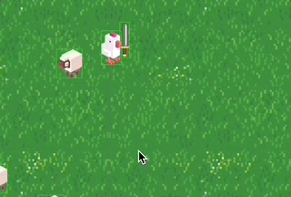

# Excalibur Advanced

- [Advanced](#advanced)
- [Actors zoeken](#actors-zoeken)
- [Wapens](#wapens)
- [Random tint](#random-tint)
- [JSON laden](#json-laden)

# Advanced
 
## Actors zoeken

De game heeft een array van actors: `this.currentScene.actors` *(Vanuit een actor is dit: `this.scene.actors`)*

Je kan met `filter` naar alle actors van een bepaald type zoeken. Je kan `find` gebruiken om een enkele actor van een type te zoeken. 

Je kan ook zelf door de actors heen loopen.

```js
class Game extends Engine {

    startGame(){
        let someShark = new Shark()
        this.add(someShark)
        for(let i = 0; i < 10; i++) {
            let f = new Fish()
            this.add(f)
        }
    }

    howManyFishes() {
        let fishes = this.currentScene.actors.filter(act => act instanceof Fish)
        console.log(`Er zijn nog ${fishes.length} vissen`)
    }

    findShark() {
        let shark = this.currentScene.actors.find(act => act instanceof Shark)
        console.log(shark)
    }

    gameOver() {
        for(let actor of this.currentScene.actors) {
           actor.kill()
        }
        this.startGame()
    }
}
```


<Br><br><br>

## Wapens



Met composition kan je een karakter verschillende wapens geven. Door te zorgen dat elk wapen dezelfde functies gebruikt, kan elk wapen een ander effect krijgen.

```js
class ArmedChicken extends Actor {
    onInitialize(engine){
        this.weapon = new Gun()
        this.addChild(this.weapon)
    }
    attack(){
        this.weapon.hit() // dit werkt voor machinegun en gun
    }
}
```
```js
class Gun extends Actor {
    hit(){
        let bullet = new Bullet()
        this.scene.engine.add(bullet)
    }
}
```
```js
class MachineGun extends Actor {
    hit(){
        for(let i = 0; i< 10;i++) {
            let bullet = new Bullet()
            this.scene.engine.add(bullet)
        }
    }
}
```
- [Voorbeeldcode kip met zwaard 🗡️🐔](https://stackblitz.com/edit/excalibur-chicken) 

<br><br><br>

## Random tint

```js
let sprite = Resources.Mario.toSprite()
sprite.tint = new Color(Math.random() * 255, Math.random() * 255, Math.random() * 255)
```

<br><br><Br>

## JSON laden

Als je `import` gebruikt wordt het JSON bestand onderdeel van je project tijdens de `build` stap. Je hoeft het niet toe te voegen aan de excalibur loader. Als de data van een externe server komt (of als het bestand heel groot is) is het beter om `fetch` te gebruiken.

VOORBEELD

```javascript
import jsonData from "../data/pokemon.json"

class Pokemon extends Actor {
    showPokemon(){
        for(let p of jsonData) {
            console.log(p)
        }
    }
}
```
<br><br><br>


