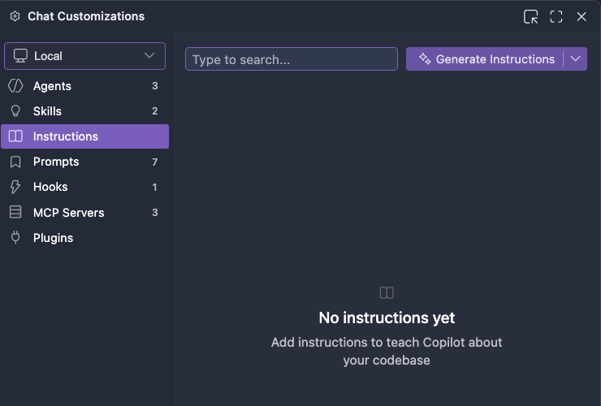
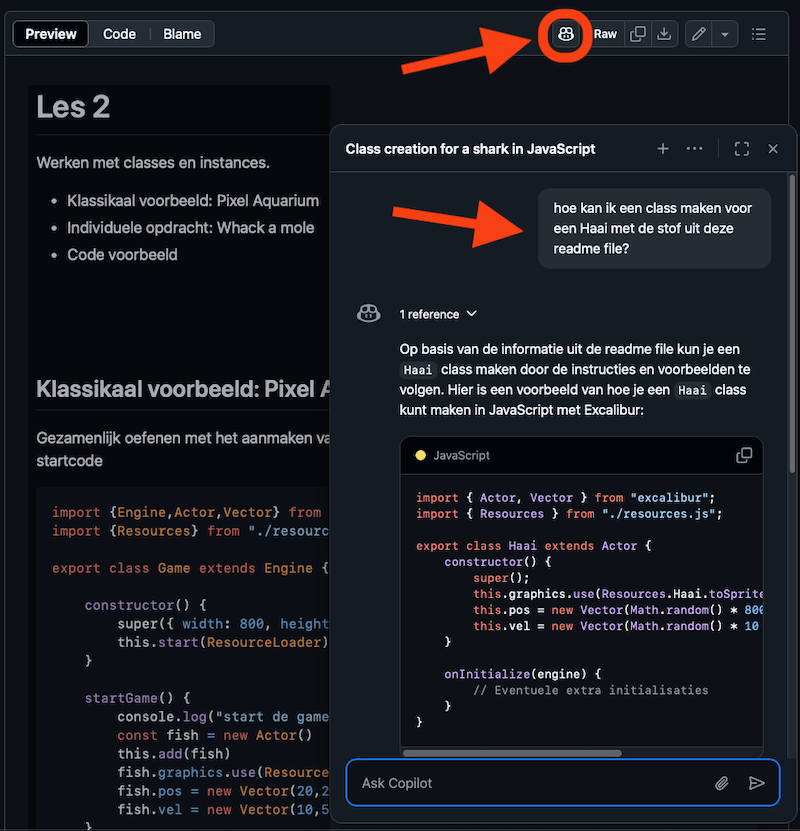
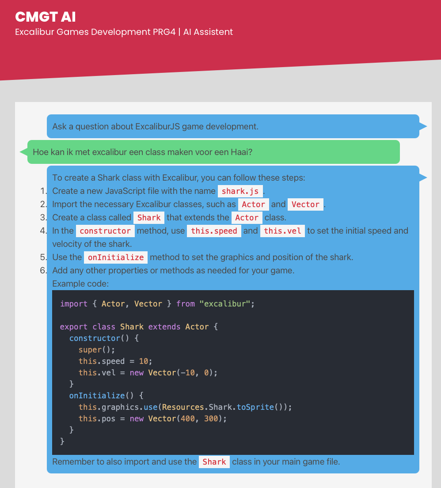

# Werken met AI

- [AI in Excalibur](#ai-in-excalibur)
- [Prompting](#prompting)
- [Je werk verantwoorden](#je-werk-verantwoorden)
- [Voorbeelden](#prompt-voorbeelden)
- [Resultaat evalueren](#resultaat-evalueren)
- [Copilot](#copilot)
- [Instructions](#instructions)
- [Chat met Github Repositories](#chat-met-de-repository)
- [CMGT chatbot](#cmgt-chatbot)

<br><br><br>

## AI in Excalibur

AI modellen zijn niet goed in het werken met Excalibur. De reden is dat er maar weinig goede code voorbeelden in de trainingdata van een AI model zit, zeker als je het vergelijkt met meer gangbare libraries zoals React. Het helpt ook niet dat de code voorbeelden van Excalibur in verschillende stijlen worden gebruikt, dit is niet altijd OOP, en werkt niet altijd met Vite.


<br><br><br>

## Prompting 

Bij het doen van een prompt in ChatGPT, Claude, Blackbox, etc. over Excalibur moet je goede instructies meegeven, omdat het antwoord anders niet voldoende overeenkomt met de werkwijze uit de lessen.

Voordat je gaat prompten, kan je deze minimale instructies sturen:

```
I am using the excaliburjs library at https://github.com/excaliburjs/Excalibur and object oriented programming, to create a game.
Please use the following code examples to format classes in the game. I use vite to test and build the game. I do not use the global "ex." namespace for excalibur.

import {Engine,Actor,Vector} from "excalibur";
import {Player} from "./player.js";
import {Enemy} from "./enemy.js";

export class Game extends Engine {
    enemy
    player
    startGame() {
        this.player = new Player()
        this.add(this.player)

        this.enemy = new Enemy()
        this.add(this.enemy)
    }
}

export class Enemy extends Actor {
    constructor(){
        super({width:100, height:100})
        this.pos = new Vector(100,100)
        this.vel = new Vector(5,0)
    }
}
```

<br><br><br>

## Prompt voorbeelden

- Start with the setup of a game with a player and a enemy
- What is the benefit of using OOP programming for games
- How can I make the player class respond to keyboard input
- I have two enemy types, can you apply inheritance here
- Why doesn't the player fall when I walk off the platform
- My game class keeps the score. How can I adjust this from my player
- I want to make the player shoot a bullet, what is a good way to handle this ?
- 🚫 Maak een game
- 🚫 Maak flappy bird
- 🚫 Hij doet het niet

<br><br><br>

## Je werk verantwoorden

Of je nu met AI werkt of niet, je bent altijd zelf verantwoordelijk voor de kwaliteit van de code die je oplevert, en voor het werken volgens de lesstof. Bij het inleveren van je werk is het essentieel dat je toelicht hoe je AI hebt gebruikt. Je moet in eigen woorden uitleggen welke keuzes je hebt gemaakt en waarom.


<br><br><br>

## Resultaat evalueren

Hieronder zie je een voorbeeld van Excalibur code die niet overeenkomt met de lessen, omdat er geen instructies zijn meegegeven

```js
const engine = new ex.Engine({
  width: 600,
  height: 400,
});

const actor1 = new ex.Actor({ width: 50, height: 50 });
engine.add(actor1);
```

<br><br><br>

## Copilot 

- Zet Copilot aan - gratis in VS Code met [student developer pack](https://education.github.com/pack)
- Leer het verschil tussen ASK / PLAN / AGENT mode, en de verschillende modellen
- Gebruik CMD/CTRL + i om inline te prompten
- Zet TAB mode uit!
- Maak een selectie in je code om daar specifiek vragen over te stelle±
- Gebruik "/" om meteen iets uit te leggen of te fixen


<br><br><br>

## Instructions 

In VS Code kan je via chat settings bepalen welke instructions je gebruikt.
Je kan ook je eigen instructions genereren, bijvoorbeeld door deze hele repository als basis te gebruiken.



<br><br><br>

## Chat met Github Repositories

Je kan in [de PRG4 repository](https://github.com/HR-CMGT/PRG04-2024-2025/) en in de officiele [Excalibur Repository](https://github.com/excaliburjs/Excalibur) op het ***copilot*** icoontje klikken om een chatvenster te openen. Je kan dan specifieke vragen over de repository stellen. 

> ⚠️ *Let op dat je hier nog steeds instructies moet meegeven, minimaal dat je met Object Oriented Programming classes werkt, zonder de "ex." namespace.*



<br><br><br>

## CMGT Chatbot

De [CMGT chatbot](https://cmgt-assistant.vercel.app) heeft de instructies over de lesstof al ingebouwd.



https://cmgt-assistant.vercel.app

<br><br><br>

