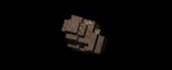
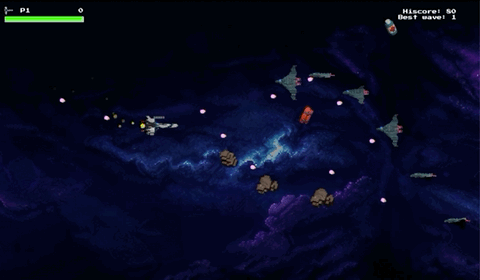
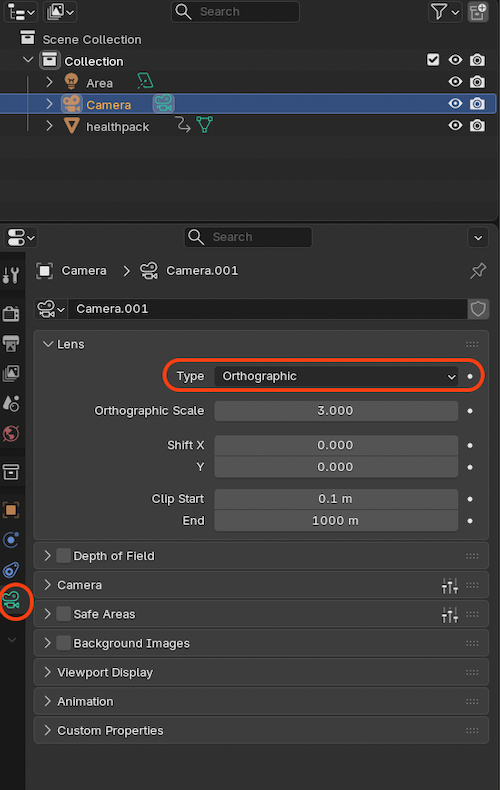
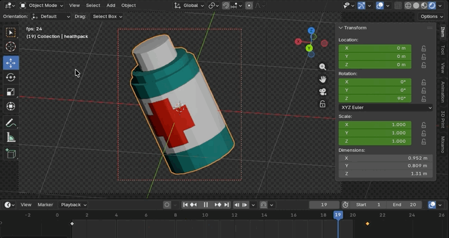
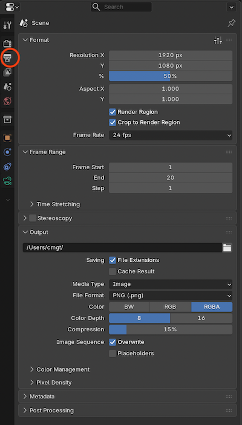
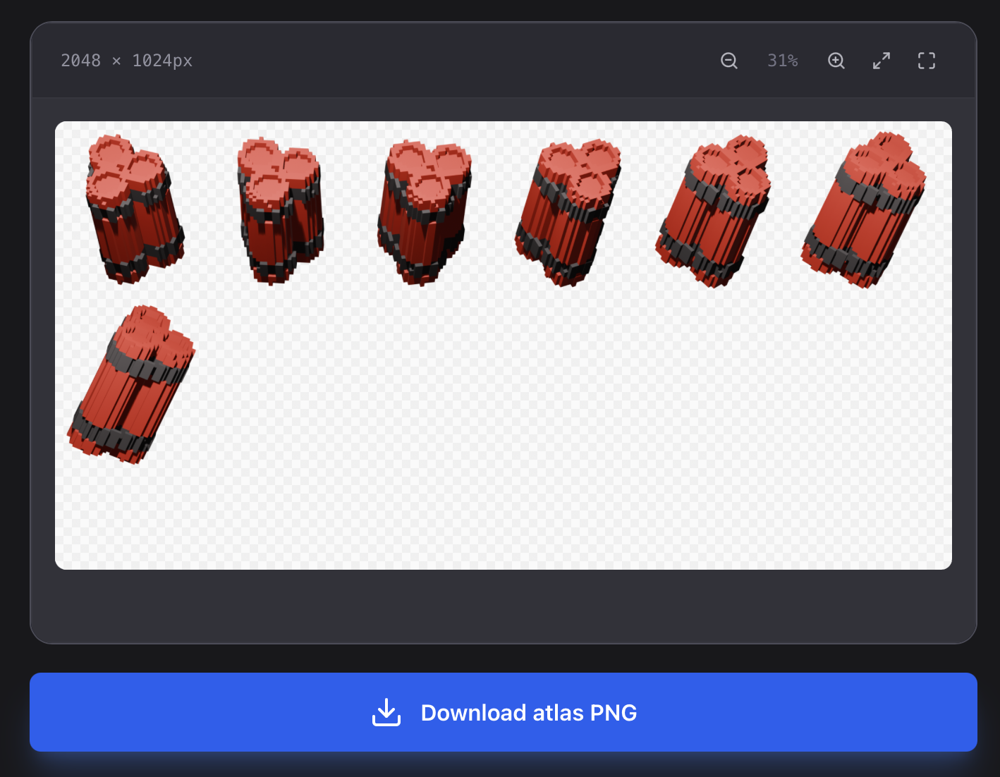

# Spritesheet maken met Blender

[Blender](https://www.blender.org/download/) is 3D software, je kan hiermee je 3D animaties opslaan als 2D frames. Deze frames kan je vervolgens als spritesheet in je 2D game inladen.

<br>
*Een losse animatie*

<br>
*Eindresultaat*

<Br><br><br>


## Model klaar zetten

- Maak of laad een 3D model in Blender
- Zorg dat de camera de juiste invalshoek heeft. Klik op het "camera" icoontje om dit te checken.
- Zet de camera op `orthographic` voor een isometrisch effect *(geen diepte / perspectief)*
- Voeg eventueel een licht toe.




<Br><br><br>


## Animatie maken

- Open het `timeline` panel in Blender.
- Blijf in `camera view` zodat je het eindresultaat kan zien.
- Selecteer je model en druk op `I` om een keyframe op frame 1 te plaatsen.
- Zet de playhead op frame 20, klik weer op je model, en roteer je model in een nieuwe positie. 
- Druk weer op `I` om een keyframe te maken. Druk op play om de animatie af te spelen.
- Keyframes hebben een `easing` method. Klik met rechts op de keyframe diamantjes en selecteer `easing > linear`.
<br>




<Br><br><br>


## Opslaan

- Onder OUTPUT geef je aan waar je frames worden opgeslagen. Het formaat is PNG met RGBA *(transparantie)*. Onder *film* moet je ook nog `transparent` aan zetten.
- Met `render region` kan je lege vlakken wegsnijden die anders om je object heen zouden komen.
- CTRL + F12 rendert alle frames naar losse PNG files.



<Br><br><br>


## Spritesheet bouwen

- Je hebt nu een mapje met losse PNG files. Deze kan je met de [I Love Sprites TexturePacker](https://ilovesprites.com/tools/images-to-atlas) samenvoegen tot een spritesheet. Zorg dat je de ***grid*** optie gebruikt.

<br>
*I love sprites texturepacker*

<Br>

- ⚠️ Je kan dit ook eenvoudig zelf met het onderstaande `NodeJS` script doen!
- Je hebt nu het sheet dat je in excalibur kan gebruiken met [dit code voorbeeld](./spritesheet.md)

<Br><br><br>

## Node Texturepacker

Met onderstaand script kan je zelf een mapje met Blender images samenvoegen tot 1 spritesheet. Je moet wel een aantal startwaarden invullen. Voer het uit met `node pack.js`. 

```sh
npm install sharp
```

```js
import sharp from 'sharp';
import fs from 'fs';
import path from 'path';
import { fileURLToPath } from 'url';

// Size of one single original frame
const ORIG_W = 340;
const ORIG_H = 451;

// Desired frame width in the spritesheet (height is calculated automatically)
const FRAME_W = 200;
const FRAME_H = Math.round((ORIG_H * FRAME_W) / ORIG_W);

// desired columns (rows = automatic)
const COLS = 5;
const NAME = "endboss";

const folder = "./boss-frames";
const outputDir = "../public";

// start 
const __filename = fileURLToPath(import.meta.url);
const __dirname = path.dirname(__filename);
const outputFile = path.join(outputDir, `generated_${NAME}.png`);

if (!fs.existsSync(outputDir)) {
    fs.mkdirSync(outputDir, { recursive: true });
}

async function packSpritesheet() {
    try {
        const files = fs.readdirSync(folder)
            .filter(f => f.endsWith('.png'))
            .sort();

        if (files.length === 0) {
            console.error("No PNG files found in", folder);
            return;
        }

        const rows = Math.ceil(files.length / COLS);
        const sheetWidth = COLS * FRAME_W;
        const sheetHeight = rows * FRAME_H;

        // Create a transparent base canvas
        let compositeOperations = [];

        for (let i = 0; i < files.length; i++) {
            const filePath = path.join(folder, files[i]);
            const left = (i % COLS) * FRAME_W;
            const top = Math.floor(i / COLS) * FRAME_H;

            // Resize the individual frame
            const resizedBuffer = await sharp(filePath)
                .resize(FRAME_W, FRAME_H)
                .toBuffer();

            compositeOperations.push({
                input: resizedBuffer,
                top: top,
                left: left
            });
        }

        // Create the final sheet
        await sharp({
            create: {
                width: sheetWidth,
                height: sheetHeight,
                channels: 4,
                background: { r: 0, g: 0, b: 0, alpha: 0 }
            }
        })
        .composite(compositeOperations)
        .png()
        .toFile(outputFile);

        console.log(`Packed ${files.length} frames (${COLS}x${rows}) -> ${outputFile}`);
        console.log(`Frame size is ${FRAME_W} x ${FRAME_H}`);
    } catch (err) {
        console.error("Error packing spritesheet:", err);
    }
}

packSpritesheet()

```