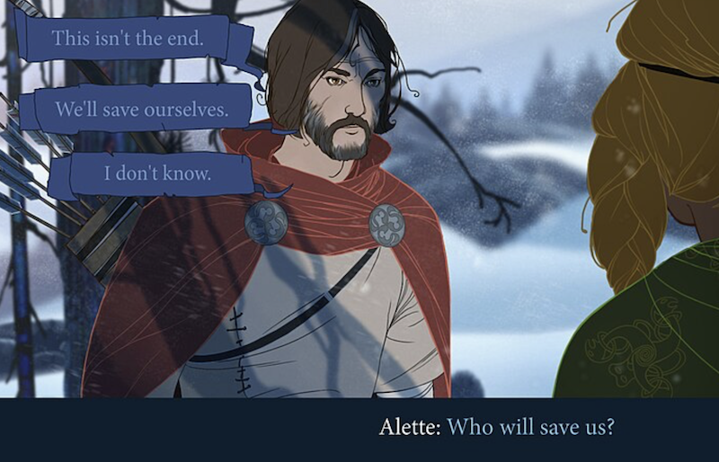

# Dialog Tree



Het maken van een Dialog Tree kan je doen met een JSON file waar al je gesprekken in staan. Met javascript kan je vervolgens de juiste dialog opzoeken, en de vraag met antwoorden tonen.

<br><br><br>


## JSON

```json
[
    {
        "id":"start-conversation",
        "question":"Hi, I'm Danny the Troll. How are you today?",
        "image":"neutral-troll.png",
        "answers":[
            {
                "text":"I'm fine, how are you?",
                "link":"nice-conversation"
            },{
                "text":"Arrrhh, a troll!",
                "link":"nasty-conversation"
            }
        ]
    },{
        "id":"nice-conversation",
        "question":"Oh I'm fine, how can I help you?",
        "image":"friendly-troll.png",
        "answers":[
            {
                "text":"Tell me the way to the troll cave",
                "link":"cave-conversation"
            },{
                "text":"Do you have some spare food?",
                "link":"food-conversation"
            }
        ]
    },{
        "id":"nasty-conversation",
        "question":"So what! Trolls are people too you know!",
        "image":"angry-troll.png",
        "answers":[
            {
                "text":"Sorry I didn't know that",
                "link":"nice-conversation"
            },{
                "text":"Prepare for a fight you nasty troll!",
                "link":"fight-conversation"
            }
        ]
    }
]
```
<br><br><br>


## Javascript

In `vite` kan je een JSON rechtstreeks importeren zonder `fetch`.

```js
import dialogData from "./dialogs.json"

function showQuestion(id) {
    // zoek de juiste dialog
    const dialog = dialogData.find(d => d.id === id)
    // vraag met achtergrond plaatje
    console.log(dialog.question)
    console.log(`    (show image:${dialog.image})`)
    // alle antwoorden
    for(let answer of dialog.answers) {
        console.log(answer.text)
        console.log(`  (if chosen, go to ${answer.link})`)
    }
}

showQuestion("start-conversation")
```

<br><br><br>

## Excalibur

In excalibur maak je een label aan voor de vraag en de drie antwoorden. Die vul je telkens met de huidige vraag en antwoorden. De labels kan je clickable maken, of gebruik een toets om een antwoord te selecteren. Begin met deze setup:

```js
import dialogData from "./dialogs.json"

export class Level extends Scene {

    onInitialize(engine) {
        this.questionLabel = new Label({
            pos: new Vector(100, 100),
            font: new Font({family: 'impact', size: 24, unit: FontUnit.Px })
        })
        this.add(label)
        this.showQuestion("start-conversation")
    }

    showQuestion(id) {
        const dialog = dialogData.find(d => d.id === id)
        this.questionLabel.text = dialog.question
    }
}
```

⚠️ Als je game grotendeels bestaat uit veel tekst en dialogen, dan kan je overwegen om dit gewoon in een HTML+CSS overlay te maken. Dit is een `<div>` die je over je excalibur game heen legt met `position:absolute`.

<br><br><br>

