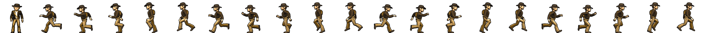
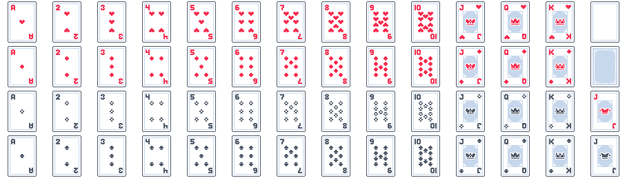

# Spritesheet

Met een `SpriteSheet` kan je meerdere sprites knippen uit een enkel PNG bestand. Dit kan je gebruiken voor Tiles of om animatieframes te laden.

- [Animatieframes](#animation-frames) in één png file
    - Walking Character
    - Loop, PingPong, End Listener
    - Custom Frames for animation
- [Tiles](#tiles-knippen) knippen uit een grotere afbeelding 
- [Frames maken met Blender](./blender.md)

<br>
<br>
<br>

# Animation Frames

Animatieframes <br>


De image source heb je geladen in `Resources`. Je hoeft hier nog geen `toSprite()` te doen, dat gebeurt automatisch.

```javascript
const runSheet = SpriteSheet.fromImageSource({
    image: Resources.Player,
    grid: { rows: 1, columns: 21, spriteWidth: 96, spriteHeight: 96 }
})

const idle = runSheet.sprites[0] // geen animatie
const runLeft = Animation.fromSpriteSheet(runSheet, range(1, 10), 80)
const runRight = Animation.fromSpriteSheet(runSheet, range(11, 20), 80)
```

Via `graphics.add` kan je meerdere graphics tegelijk toevoegen. In dit geval de idle sprite, en de running left,  right animaties. Met `graphics.use` kan je zeggen welke animatie op dit moment getoond moet worden.

```javascript
this.graphics.add("idle", idle)
this.graphics.add("runleft", runLeft)
this.graphics.add("runright", runRight)

this.graphics.use(idle)
```

### Flip animation

In plaats van een aparte animatie te maken voor links en rechts, kan je ook de animatie flippen. Dit doe je met `animation.flipHorizontal = true`

```javascript
let left = Animation.fromSpriteSheet(spriteSheetRun, range(1, 10), 50)
let right = left.clone()
right.flipHorizontal = true
```


<br><br><br>

### Walking character

In dit voorbeeld gebruiken we keyboard controls om de verschillende animaties te tonen.

RESOURCES.JS
```javascript
let Resources = {
    Player: new ImageSource(playerImage),
}
```
PLAYER.JS
```javascript
export class Player extends Actor {

    constructor() {
        super()
        const runSheet = SpriteSheet.fromImageSource({
            image: Resources.Player,
            grid: { rows: 1, columns: 21, spriteWidth: 96, spriteHeight: 96 }
        })
        const idle = runSheet.sprites[0] // geen animatie
        const runLeft = Animation.fromSpriteSheet(runSheet, range(1, 10), 80)
        const runRight = Animation.fromSpriteSheet(runSheet, range(11, 20), 80)

        this.graphics.add("idle", idle)
        this.graphics.add("runleft", runLeft)
        this.graphics.add("runright", runRight)

        this.graphics.use(idle)
    }
    onInitialize(engine) {
        this.pos = new Vector(400,200)
        this.vel = new Vector(0,0)
    }
    onPreUpdate(engine) {

        let xspeed = 0
        this.graphics.use('idle')
    
        if (engine.input.keyboard.isHeld(Keys.A) || engine.input.keyboard.isHeld(Keys.Left)) {
            xspeed = -300
            this.graphics.use('runleft')
        }
        if (engine.input.keyboard.isHeld(Keys.D) || engine.input.keyboard.isHeld(Keys.Right)) {
            xspeed = 300
            this.graphics.use('runright')
        }

        this.vel = new Vector(xspeed, 0)
    }

}
```

<br><br><bR>

## Loop, PingPong, End Listener

Via `AnimationStrategy` kan je bepalen of een spritesheet animatie eeuwig moet loopen, pingpongen of stoppen aan het eind. Je kan een `listener` toevoegen om code uit te voeren als de animatie is afgelopen.

```js
import { Actor, SpriteSheet, Vector, Animation, range, Keys, AnimationStrategy } from "excalibur";
import { Resources } from "./resources";

export class Player extends Actor {

    onInitialize(engine) {

        const updownSheet = SpriteSheet.fromImageSource({
            image: Resources.PlayerSheet,
            grid: { rows: 10, columns: 4, spriteWidth: 128, spriteHeight: 72 }
        })        

        const idleAnim = Animation.fromSpriteSheet(updownSheet, range(0, 10), 60)
        const moveDown = Animation.fromSpriteSheet(updownSheet, range(11, 20), 60)
        const moveUp = Animation.fromSpriteSheet(updownSheet, range(21, 40), 60)

        // what to do when animation finishes
        idleAnim.strategy = AnimationStrategy.PingPong
        moveDown.strategy = AnimationStrategy.End
        moveUp.strategy = AnimationStrategy.End

        // set back to idle when animation has finished
        moveDown.events.on('end', () => this.graphics.use("idle"))
        moveUp.events.on('end', () => this.graphics.use("idle"))

        this.graphics.add("idle", idleAnim)
        this.graphics.add("moveDown", moveDown)
        this.graphics.add("moveUp", moveUp)

        this.graphics.use("idle")
    }
}
```
<br>

### Custom Frames voor Animatie

Je kan ook zelf aangeven welke frames in welke volgorde een animatie gaan vormen:

```js
const customIndices = [1,1,1, 1,1,1,1,2, 3, 4,5];
const customAnim = Animation.fromSpriteSheet(updownSheet, customIndices, 80);
```

<br><br><br>

# Tiles knippen uit een afbeelding

Tilemap tiles <br>


Je kan alle tiles voor je achtergrond uit één afbeelding laden en individueel inladen. Let op, je hebt hier geen tilemap of tiled plugin nodig, alles wat we doen is plaatjes knippen uit een grotere afbeelding.

#### GAME.JS

```js
export class Game extends Engine {

    constructor() {
        super({ width: 800, height: 600, suppressHiDPIScaling: true })
        this.start(ResourceLoader).then(() => this.startGame())
    }

    startGame() {
        const tileMap = new TileMap(spriteSheet)
        this.add(tileMap)
    }
}
new Game()
```

#### TILEMAP.JS

```js
import { Actor, SpriteSheet, Vector, Random } from "excalibur";
import { Resources } from "./resources";

export class TileMap extends Actor {

    onInitialize(engine) {
        const spritesheet = SpriteSheet.fromImageSource({
            image: Resources.Tiles,
            grid: {
                rows: 4, columns: 4, spriteWidth: 256, spriteHeight: 256,
            },
            // je kan aangeven of er lege ruimte of marges in de afbeelding zitten
            // spacing: {
            //     originOffset: { x: 11, y: 2 },
            //     margin: { x: 23, y: 5 },
            // },
        });
        // test of alle sprites er zijn
        console.log(spritesheet.sprites)

        let act1 = new Actor({anchor:Vector.Zero})
        act1.graphics.use(spritesheet.sprites[0])
        act1.pos = new Vector(0,0)
        this.addChild(act1)

        let act2 = new Actor({ anchor: Vector.Zero })
        act2.graphics.use(spritesheet.sprites[1])
        act2.pos = new Vector(256, 0)
        this.addChild(act2)
    }
}
```
<br><Br><br>

## Blender

🔥 [Je kan je "fake 3D" animatieframes maken met Blender](./blender.md)


